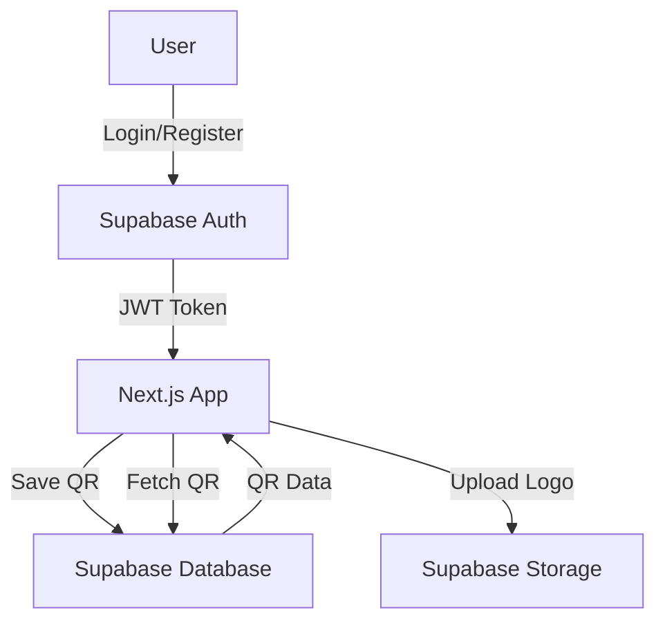

# QR Code Generator - Authentication Feature Plan

## Project Overview
Add user authentication and persistent QR code storage to the QR Code Generator using Supabase.

## Goals
1. Allow users to sign up/login (email/password + social providers)
2. Save generated QR codes to user's personal library
3. Enable editing of previously saved QR codes
4. Provide dashboard to manage all saved QR codes

## Tech Stack
- **Auth**: Supabase Auth (Email/Password + Google OAuth)
- **Database**: Supabase PostgreSQL
- **Storage**: Supabase Storage (for QR code images)
- **Frontend**: Next.js 16 + React 19

---

## Database Schema

### Table: `profiles`
| Column | Type | Description |
|--------|------|-------------|
| id | uuid | FK to auth.users |
| username | text | User's display name |
| avatar_url | text | Profile picture URL |
| created_at | timestamptz | Account creation time |

### Table: `qr_codes`
| Column | Type | Description |
|--------|------|-------------|
| id | uuid | Primary key |
| user_id | uuid | FK to profiles.id |
| title | text | QR code name |
| qr_type | text | Type (url, text, wifi, etc.) |
| content | jsonb | All QR data (type-specific) |
| fg_color | text | Foreground color |
| bg_color | text | Background color |
| error_correction | text | Error correction level |
| logo_url | text | URL to uploaded logo |
| logo_size | integer | Logo size percentage |
| qr_image_url | text | Stored QR code image |
| created_at | timestamptz | Creation time |
| updated_at | timestamptz | Last edit time |

---

## Feature Roadmap

### Phase 1: Setup & Authentication
- [ ] Create Supabase project
- [ ] Configure environment variables
- [ ] Install Supabase client libraries
- [ ] Create auth context/hooks
- [ ] Build login/signup UI
- [ ] Add auth middleware

### Phase 2: Database & Storage
- [ ] Set up database tables (profiles, qr_codes)
- [ ] Configure RLS policies
- [ ] Set up storage bucket for QR images
- [ ] Create API functions for CRUD operations

### Phase 3: QR Code Management
- [ ] Modify generator to save on demand
- [ ] Create dashboard page for user's QR codes
- [ ] Add edit functionality
- [ ] Add delete functionality
- [ ] Add duplicate/create variant feature

### Phase 4: UI/UX Improvements
- [ ] Add user profile page
- [ ] Add loading states
- [ ] Add notifications/toasts
- [ ] Add share functionality

---

## Mermaid: System Architecture

---

## Implementation Notes

1. **RLS (Row Level Security)**: Users can only access their own QR codes
2. **Auto-save option**: Consider adding auto-save when generating
3. **Guest mode**: Allow QR generation without login, prompt to save
4. **Export**: Keep PNG/SVG export, add "Save to Library" button
5. **Offline support**: Consider PWA for offline QR generation

---

## Estimated Effort
- Phase 1: 2-3 hours
- Phase 2: 2-3 hours  
- Phase 3: 3-4 hours
- Phase 4: 1-2 hours

**Total: ~8-12 hours**
